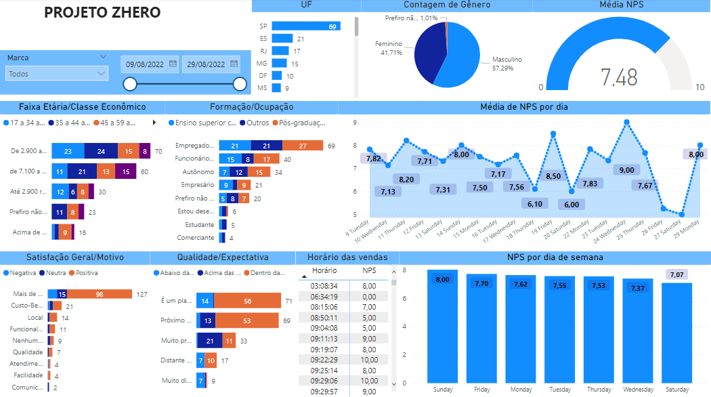

# PROJETO ZHERO

## Objetivo
O seguinte repositório tem o objetivo de usar a base de dados disponibilizada pela Empresa Zhero, e com isso fazer um Dashbord na plataforma Power BI.

## Análise
A leitura e análise dos dados foi feita toda em Jupyter Notebook, com a linguagem de programação Python, e pode ser vista no seguinte link: 
- [Leitura e Análise dos dados](https://nbviewer.org/github/leandrosantana09/projeto_teste_zhero/blob/main/data_analises.ipynb)

# O Dashbord

Um resumo do dashbord pode ser visto na seguinte imagem,

O link para download do dashbord - [Dashbord](https://github.com/leandrosantana09/projeto_zhero/tree/main/dash)

 ## Ferramentas utilizadas:

 - Jupyter Notebook;
 - Python (especificamente a biblioteca pandas);
 - nbviewer;
 - Microsoft Power BI.
 

 # Informações importantes:
 
 - As bibliotecas específicas se encontram no arquivo 'requirements.txt'

 # CONTATO PROFISSIONAL

- Linkedin: https://www.linkedin.com/in/santana-leandro/
- Email: leandro09@unifei.edu.br